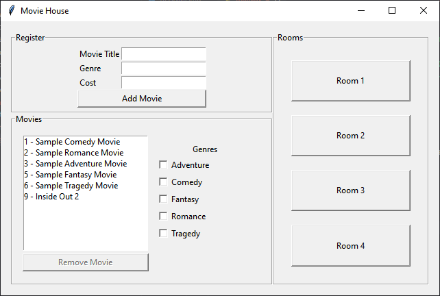
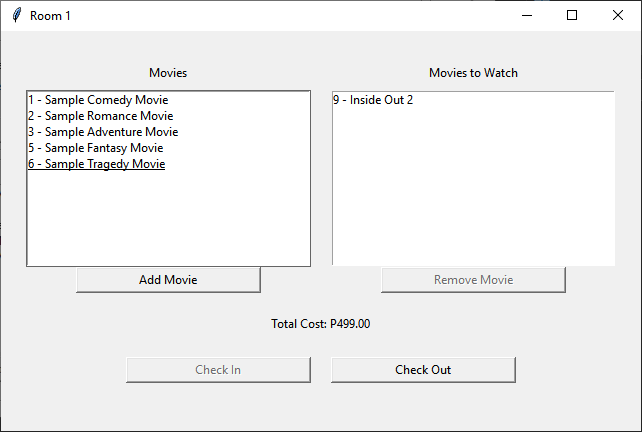
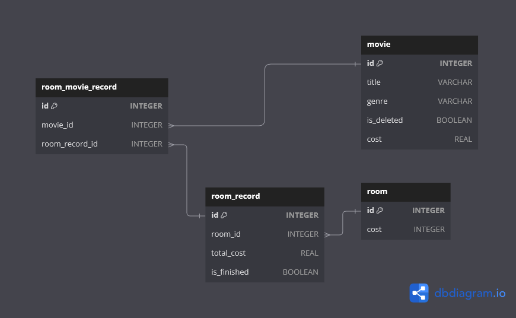

# Movie House Manager (Tkinter with Database)
> Object-Oriented Programming - Lab Activity 7

This project is a Tkinter-based GUI application that manages room usage for movie viewing in a movie house. The application allows users to check in and check out movies for different rooms, ensuring that movies are not double-booked across rooms.

## Features

- Add movies to a room's viewing list.
- Remove movies from a room's viewing list.
- Check-in functionality to record movies scheduled for viewing in a room.
- Check-out functionality to mark the viewing session as complete and clear the room's viewing list.
- Prevents assigning the same movie to multiple rooms simultaneously.
- Displays room usage logs with relevant details.

## Installation

1. **Clone the repository:**
    ```bash
    git clone https://github.com/your-username/sheet.git
    cd room-usage-log-sheet
    ```

2. **Install required dependencies:**
    This project requires Python and Tkinter. You can install Tkinter using pip:
    ```bash
    pip install tkinter
    pip install sqlite3
    ```

4. **Initialize the Database (Important):**
    Execute this script to create a database file named movie.db
    It will manually enter a database with 4 tables and 4 rooms.
    Change the values under room list if neeeded.
    ```bash
    python database_init.py
    ```

3. **Run the application:**
    ```bash
    python main.py
    ```

## Screenshots



## Author/Programmer
- **Joshua Mistal** - Initial work - [JoshuaHM-p4](https://github.com/JoshuaHM-p4)

# EXPLANATION

## Relationships
* Many-to-One Relationships
    - A group of five college students is given a project that they must accomplish in a month's time.
    - It describes the connection between the two entities, Student and Project.

* One-to-Many Relationships
    - If the two entity types are 'Customer' and 'Account,' each 'Customer' can have many 'Accounts,' but each 'Account' can only be owned by one 'Customer. ' In this case, we can say that each customer is linked to a number of accounts.

* Many-to-Many Relationships
    - When the entity types 'Customer' and 'Product' are combined, each customer can purchase several products, and a product can be purchased by multiple customers.

## Database Schema Explained


> Visualization of Lab Activity 7 Relationships

1. `room`:
    - Represents physical rooms, each with a unique ID and a cost.

2. `movie`:
    - Represents movies, each with a unique ID, title, genre, deletion status, and cost.

3. `room_record`:
    - Represents sessions or records of room usage, each linked to a specific room (via room_id).

4. `room_movie_record`:
    - Represents the many-to-many relationship between movies and room records, allowing multiple movies to be associated with a single room session and vice versa.

## Relationships Explained

1. `room` to `room_record`
    - Type: One-to-Many
    - Explanation: Each room can have multiple usage records. For example, Room 1 can be used multiple times, resulting in multiple entries in the room_record table with room_id referencing Room 1.

2. `movie` to `room_movie_record`
    - Type: One-to-Many
    - Explanation: Each movie can be associated with multiple room usage records. For example, Movie A can be shown in multiple room sessions, resulting in multiple entries in the room_movie_record table with movie_id referencing Movie A.
    - SQL Representation: room_movie_record has a foreign key movie_id that references movie(id).

2. `room_record` to `room_movie_record`
    - Type: One-to-Many
    - Explanation: Each room usage record can involve multiple movies. For example, a session recorded in Room 1 can have multiple movies shown during that session, resulting in multiple entries in the room_movie_record table with room_record_id referencing the specific room session.
    - SQL Representation: room_movie_record has a foreign key room_record_id that references room_record(id).

## Summary of Relationships
1. room to room_record: One-to-Many
    - Each room can have multiple records of usage.
    - room_record table references room table through room_id.

2. movie to room_movie_record: One-to-Many
    - Each movie can appear in multiple room usage records.
    - room_movie_record table references movie table through movie_id.

3. room_record to room_movie_record: One-to-Many
    - Each room usage record can involve multiple movies.
    - room_movie_record table references room_record table through room_record_id.

## (Taglish) Explanation
Sa ating database meron tayong table for rooms, each rooms, let's say (Room A), ay atleast merong atleast isa or maraming room_records (Room_Record 2, Room_Record 2, ...). Each room records ay nagrerepresent ng isang session sa paggamit ng room like parang sa CEA gumamit tayo ng room isang schedule kaya may isang session tayo sa log book. So one-to-many relationship from room to room_record.

Pwede rin sabihin na maraming room_records ay pwede sa isang room (many-to-one from room_record to room)

Sa bawat room ay session ay pwede mag include ng iilang movies, let's say sa session sa Room 1 merong Movie A, Movie B and Movie C etc. So one-to-many relationship din tayo for each room_record session to movies .

May table tayo for movies, each movie ay pwede sa isang room_movie_record sa table. Ibigsabihin meron tayong maraming movies na iilan nakatakda sa room_records or marami tayong room_records na pwede sa kahit iilang movies. Movie A ay pwede sa isang Room_record 1, Movie A, B, C, pwede sa Room_Record 2 OR Room_Record 3, etc.
